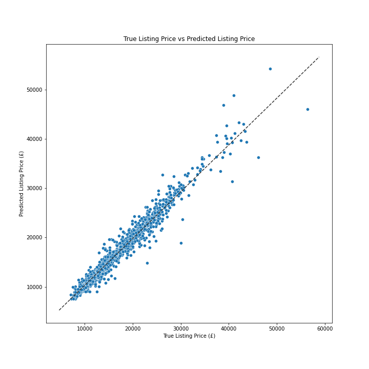
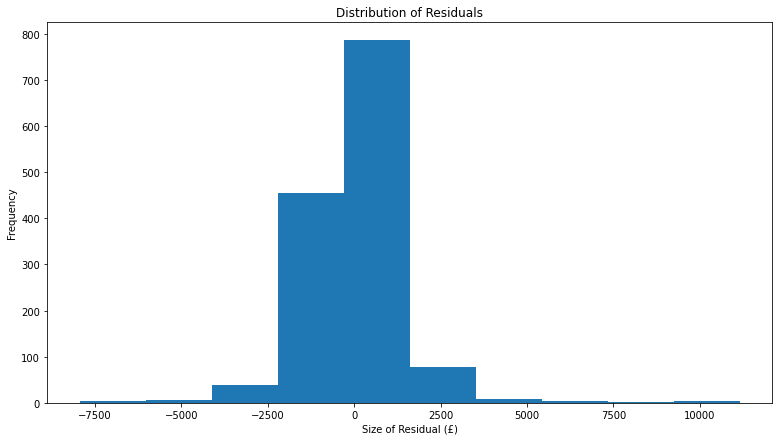
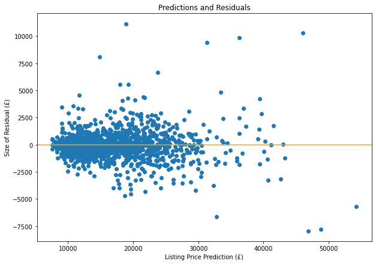

# Capstone - Predicting Car Listing Prices in the UK
#### Giovanni Ceretti | DSI 523

## Problem Statement

Cars are essential parts of an individual's or a family's life. They represents more than simply a method of transportation but rather a way for people to complete essential, mandatory life tasks such as getting to work, taking kids to school and doing groceries. Cars are often a family unit's second largest asset after their home and often represent a meaningful part of a family's monthly spend through auto loan payments. Due to the often immense financial commitment required to buy a car, families should be looking at the purchase of a vehicle as an investment. Families have many different requirements for their vehicles but one that is ubiquitous, is the desire and often the need to make sure that their vehicles are both purchased and sold at the best valuations possible.

This project and its associated Streamlit application hope to provide car buyers and sellers an insight into the British auto reselling market and provide them with predicted listing prices for vehicles based on a variety of key characteristics to help them in their journey of buying and selling their vehicles.

## Datasets

In order to address this problem statement, raw data was scraped from all vehicle listings found on [Cazoo](https://www.cazoo.co.uk/), a leading British online auto-reseller. The data used in this project's analysis will use data from early August 2022. However, the web scraping function can be used on an on-demand basis and pull current data whenever the user runs the function.

Once the raw data was scraped, each scraped feature was cleaned, prepared for modelling and saved to a final model-ready csv, [`cazoo_cleaned`](./datasets/cazoo_cleaned.csv). All data cleaning and data preparation efforts can be found in the [`data_cleaning`](./code/data_cleaning.ipynb) notebook.

#### Data files
  * [`cazoo_raw_data`](./datasets/cazoo_raw_data.csv)
  * [`cazoo_cleaned`](./datasets/cazoo_cleaned.csv)

## Data Dictionary

Below is a data dictionary for the [`cazoo_cleaned`](./datasets/cazoo_cleaned.csv) dataset. This dataset has the input variables formatted in the form in which they will be passed through predictive models. The categorical variables in this data dictionary will be one-hot encoded prior to modelling.

| Column Name  | Data Type | Description  |
| ------------- | ------------- | ------------- |
| car_make  | object | Name of vehicle make (eg. Audi, Ford, Toyota)  |
| car_model  | object |Name of vehicle model (eg. Q7, F-150, Camry)  |
| listing_price  | int |Vehicle listing Price on Cazoo's website in early August 2022 |
| trim  | object |Vehicle trim type |
| mileage  | int |Odometer mileage of the vehicle  |
| car_age  | int |Age of vehicle; difference between 2022 and vehicle registration year (Cars from 2022 assigned value of 0.5)  |
| transmission  | object |Vehicle transmission type: Automatic or Manual  |
| color  | object|Vehicle exterior color  | 
| car_engine  | object|Vehicle engine size  | 
| car_body  | object|Vehicle body type (eg. 5 door SUV, 5 door hatchback, 2 seat coupe)  | 

## Project Summary

This project is split into 4 distinct sections:
* Data Acquisition
* Data Cleaning and Preparation
* Predictive Modelling
* Interactive Streamlit Appplication

####  Data Acquisition

In order to acquire data from all Cazoo listings, a web-scraping function using the Beautiful Soup package was created. This function pulls the individual listing urls from the multi-listing search pages. This list of urls is then used to pull the HTML files from the individual listing web pages. The function then loops through all of the individual listing web pages pulling key characteristic elements for each vehicle. The characteristics for each listing are then fed into a dictionary as an individual entry. This dictionary is then turned into the [`cazoo_raw_data`](./datasets/cazoo_raw_data.csv) csv file.

####  Data Cleaning and Preparation

In this section of the project the raw data must be cleaned and formatted for use in the predictive model. The raw data pulled from Cazoo contains all the data but is not formatted in the required way. The process for cleaning the data has been laid out below:

1. Duplicate entries are removed. Duplicate entries are a possibility given how Cazoo presents their listings on their website
2. The data is then checked for null values with any null values are assigned appropriate values. Null values occasionally occur in the `car_engine` variable if the car is electric and in the `trim` variable if there is no specified trim in the listing
3. Columns irrelevant to the model process are removed such as `car_url`
4. Car make names (eg. Audi, Ford, Toyota) are stripped out of the `car_model` variable to create a `car_make` variable
5. The `car_model` column is refined to include the car model label exclusively
6. Car models with less than 5 listings are removed. These car models lack enough data points on which to make accurate predictions and are likely not very popular car models which our user will want to query.
7. `listing_price` is transformed from a 'GBP' formatted string to integer form
8. A `car_age` column is created by calculating the difference between 2022 and vehicle registration year (Cars from 2022 assigned value of 0.5)
9. `mileage` is transformed from a 'miles' formatted string to integer form
10. The `color` variable is standardized. Many car makes have their own color definitions, as such we need to standardize these into a pre-determined subset of the most popular car colors.

Once the data has been completed cleaned and is considered 'model ready', it is saved as [`cazoo_cleaned`](.datasets/cazoo_cleaned.csv)

####  Predictive Modelling

Once the data has been cleaned, it is ready to be passed through a model and generate listing price predictions. Given the `listing_price` target variable is a large continuous numerical variable, it made sense to use a multi-linear regression model. The model variables were made up of both categorical and numerical variables. The categorical variables had to be one-hot encoded, while the numerical variables could be used for some feature engineering. The model was continuously iterated on until its performance achieved satisfactory levels of predictive capacity.

A train/test split was used to evaluate the model with test statistics such as R2, RMSE and MAE measured. Once the best performing model had been identified, the model, alongside some other key app inputs was pickled for use in the Streamlit App.

Once the model portion of the project began, the `car_body` and `car_engine` columns were removed as target variables. The values in these columns are almost perfectly correlated to the `model` and `trim` columns, respectively. Removing these columns has little effect on the quality of the predictive model and makes the final Streamlit app more user friendly, due to fewer required user inputs.

####  Interactive Streamlit Application

One of the key deliverables in this project is an application which allows individuals to input the key characteristics of a vehicle they are considering purchasing or selling to generate a predicted listing price. The Streamlit app, using pickled models and inputs, enables users to make these predictions in an easy and intuitive manner thanks to the use of dependant drop down menues for all categorical variables.

## Evaluation of Final Model

The best performing model, in terms of both R2 and MSE scores, generated a test R2 statistic of 0.960 and an MSE of £1,853,225. This score implies that 96% of the variance in listing price is explained by the input variables in the model. The null model, a model where all of the predictions are the mean listing price of the sample of cars, generated and MSE of £48,556,014, marking an enormous improvement in predictive capacity.

The best performing model had a training R2 score of 0.986, which implies that the model is somewhat overfit. A number of efforts were taken to reduce overfitting such as feature engineering and a target variable log transformation which made material improvements to the initial iterations of the models. 

The best performing model had the target variable, `listing_price`, log transformed and had the `car_age` variable feature engineered.

#### `listing_price` (Target Variable) Column statistics
* Standard Deviation: £6,968
* Mean: £17,346
* Median: £15,550

#### Null Model Metrics
* Null Model Mean Squared Error: £48,556,014
* Null Model Root Mean Squared Error: £6,968
* Null Model Mean Absolute Error: £5,368

#### Best Performing Predictive Model Metrics
* Model MSE: £1,853,225
* Model RMSE: £1,361
* Model MAE: £867

As shown by the statistics above, the best performing predictive model shows a material improvement to the null model. RMSE and MAE statistics showed an improvement of 80% and 84%, respectively.

The model's MAE is equal to 1/8th of the standard deviation of the listing prices, which underlines the model's high predictive capacity.
        
### Key Charts showing Final Model Predictive Capacity

#### Predicted vs True Listing Price Plot

As you can see below, the plots of predicted sale prices and true sales prices are closely aligned along the x = y axis. The plot below shows that the model is adept at predicting the listing prices of cars with a value of less than £30,000. If the model has to predict the listing price of more valuable vehicle, its predictions are not as strong.

This should still be considered an excellent result as 95% of cars from the dataset had a listing price of less than £30,000.

#### Analysis of Residuals

From the plot below we can see that the model is more likely to predict a listing price greater than the true listing price.

From this plot, the above statement regarding the model being a better predicter of listing prices of lower value cars is confirmed by the graph plotting residuals vs listing price predictions. In this plot, you can see greater bunching around the zero residual line amongst the lower listing price vehicles.

### Conclusion

The evaluation metrics and graphs above show that this project will be a very useful tool for both buyers and sellers of vehicles in the UK. Users can be confident in the predictions generated by the project and will be able to accurately garner the expected listing price of the vehicle they are searching for. The predictive model underpinning the project had a vert strong test R2 statistic of 0.960 and an MAE statistic of 1/8th the standard deviation of the target variable.

#### Next Steps

The drawbacks of this project is that it is only able to predict listing prices for car models which were on Cazoo at the time of the web scraping efforts. If a car model does not have 6 or more listings it will not be searchable within the Streamlit application. The only way to improve this would be to be able to pull more car data however we are limited to the number of listings available on Cazoo.

Furthermore, this project focuses on listing prices rather than completed transaction prices which is a better measure of true car value. The only way to improve on this issue is to pull purchase price data which is not readily avaiable on Cazoo.